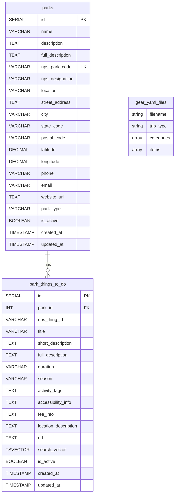

# TripBuddy Database Schema

## Entity Relationship Diagram - Base Schema



## Database Indexes - Base Schema

### **Performance Indexes**

#### **Parks Table**

- `idx_parks_nps_park_code` - B-tree index on `nps_park_code`
- `idx_parks_state_code` - B-tree index on `state_code`
- `idx_parks_location` - GIN full-text index on name, description, and location
- `idx_parks_active` - B-tree index on `is_active`

#### **Park Things To Do Table**

- `idx_park_things_park_id` - B-tree index on `park_id` (FK)
- `idx_park_things_season` - B-tree index on `season`
- `idx_park_things_tags` - GIN index on `activity_tags` array
- `idx_park_things_search_vector` - GIN index on `search_vector`
- `idx_park_things_active` - B-tree index on `is_active`
- `idx_park_things_duration` - B-tree index on `duration`

### **Full-Text Search Indexes**

#### **Parks Full-Text Search**

```sql
idx_parks_full_text - GIN index on:
  to_tsvector('english',
    name || ' ' ||
    COALESCE(description, '') || ' ' ||
    COALESCE(full_description, '') || ' ' ||
    COALESCE(location, '')
  )
```

#### **Things To Do Full-Text Search**

Uses dedicated `search_vector` column with automatic trigger updates:

```sql
idx_park_things_search_vector - GIN index on search_vector column
  (automatically populated via trigger with:
    title || ' ' ||
    COALESCE(short_description, '') || ' ' ||
    COALESCE(full_description, '') || ' ' ||
    COALESCE(location_description, '') || ' ' ||
    COALESCE(accessibility_info, '') || ' ' ||
    array_to_string(activity_tags, ' ')
  )
```

### **Unique Constraints**

- `parks(nps_park_code)` - Ensures unique NPS park codes
- `park_things_to_do(park_id, nps_thing_id)` - Prevents duplicate things to do per park

### **Triggers**

#### **Search Vector Auto-Update**

```sql
trigger_update_park_things_search_vector
  - Automatically updates search_vector when park_things_to_do content changes
  - Updates updated_at timestamp
  - Triggers on INSERT and UPDATE operations
```

## Key Features - Base Schema

### **Core Entities**

- **parks**: Main park information with NPS API integration
- **park_things_to_do**: Detailed activity descriptions with full-text search

### **NPS API Integration**

- **parks**: Core park data from NPS API
- **park_things_to_do**: Activities and attractions from NPS thingstodo endpoint

### **External References**

- **Gear Templates**: Managed as YAML files (not in database)
  - `backpacking.yaml`
  - `car_camping.yaml`
  - `day_hiking.yaml`

### **Search Capabilities**

- **Full-text search** on parks using PostgreSQL `tsvector`
- **Dedicated search vector** on park_things_to_do with automatic updates
- **Activity tag search** using array indexing

### **Simplified MVP Architecture**

This base schema focuses on:

1. **Park Data Storage** - Essential NPS API integration
2. **Activity Search** - Full-text search on things to do
3. **Performance** - Optimized indexes for core search functionality

### **Application Layer Responsibilities**

- **Gear Recommendations**: Handled via YAML templates + stateless API
- **User Sessions**: Managed in application memory or external cache
- **Advanced Features**: Available via schema-extension1.sql when needed

### **Extension Path**

When ready for advanced features, run `schema-extension1.sql` to add:

- Activities and park_activities tables
- Park images and multimedia
- RAG documents system
- Enhanced search capabilities
