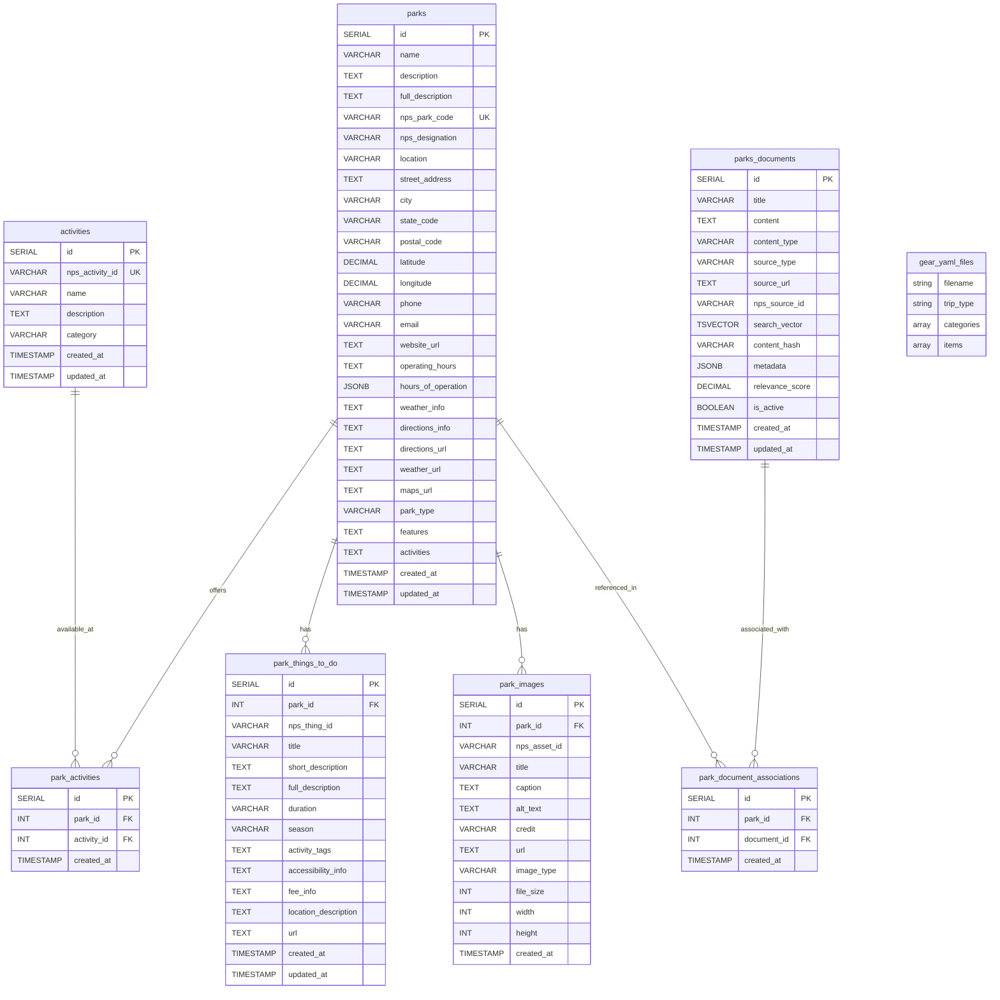

# TripBuddy Database Schema

## Entity Relationship Diagram



## Database Indexes

### **Performance Indexes**

#### **Parks Table**

- `idx_parks_nps_park_code` - B-tree index on `nps_park_code`
- `idx_parks_state_code` - B-tree index on `state_code`
- `idx_parks_features` - GIN index on `features` array
- `idx_parks_activities` - GIN index on `activities` array

#### **Activities Table**

- `idx_activities_nps_id` - B-tree index on `nps_activity_id`
- `idx_activities_name` - B-tree index on `name`
- `idx_activities_category` - B-tree index on `category`

#### **Park Activities Table (Junction)**

- `idx_park_activities_park_id` - B-tree index on `park_id` (FK)
- `idx_park_activities_activity_id` - B-tree index on `activity_id` (FK)

#### **Park Things To Do Table**

- `idx_park_things_park_id` - B-tree index on `park_id` (FK)
- `idx_park_things_season` - B-tree index on `season`
- `idx_park_things_tags` - GIN index on `activity_tags` array

#### **Park Images Table**

- `idx_park_images_park_id` - B-tree index on `park_id` (FK)
- `idx_park_images_type` - B-tree index on `image_type`

#### **Parks Documents Table**

- `idx_parks_documents_content_type` - B-tree index on `content_type`
- `idx_parks_documents_source_type` - B-tree index on `source_type`
- `idx_parks_documents_active` - B-tree index on `is_active`
- `idx_parks_documents_search` - GIN index on `search_vector`
- `idx_parks_documents_relevance` - B-tree index on `relevance_score`
- `idx_parks_documents_hash` - B-tree index on `content_hash`

#### **Park Document Associations Table (Junction)**

- `idx_park_document_associations_park_id` - B-tree index on `park_id` (FK)
- `idx_park_document_associations_document_id` - B-tree index on `document_id` (FK)

### **Full-Text Search Indexes**

#### **Parks Full-Text Search**

```sql
idx_parks_full_text - GIN index on:
  to_tsvector('english',
    name || ' ' ||
    COALESCE(description, '') || ' ' ||
    COALESCE(full_description, '') || ' ' ||
    COALESCE(location, '') || ' ' ||
    COALESCE(weather_info, '') || ' ' ||
    array_to_string(features, ' ') || ' ' ||
    array_to_string(activities, ' ')
  )
```

#### **Things To Do Full-Text Search**

```sql
idx_park_things_full_text - GIN index on:
  to_tsvector('english',
    title || ' ' ||
    COALESCE(short_description, '') || ' ' ||
    COALESCE(full_description, '') || ' ' ||
    array_to_string(activity_tags, ' ')
  )
```

#### **Documents Full-Text Search**

```sql
idx_parks_documents_full_text - GIN index on:
  to_tsvector('english',
    COALESCE(title, '') || ' ' ||
    content
  )
```

### **Unique Constraints**

- `parks(nps_park_code)` - Ensures unique NPS park codes
- `activities(nps_activity_id)` - Ensures unique NPS activity IDs
- `activities(name)` - Ensures unique activity names
- `park_activities(park_id, activity_id)` - Prevents duplicate activity associations per park
- `park_things_to_do(park_id, nps_thing_id)` - Prevents duplicate things to do per park
- `park_images(park_id, nps_asset_id)` - Prevents duplicate images per park
- `parks_documents(content_hash)` - Ensures unique document content globally
- `park_document_associations(park_id, document_id)` - Prevents duplicate document associations per park

### **Triggers**

#### **Search Vector Auto-Update**

```sql
trigger_update_parks_documents_search_vector
  - Automatically updates search_vector when parks_documents content changes
  - Updates updated_at timestamp
  - Triggers on INSERT and UPDATE operations
```

## Key Features

### **Core Entities**

- **parks**: Main park information with NPS API integration
- **parks_documents**: RAG content for LLM context

### **NPS API Integration**

- **park_activities**: Activities available at each park
- **park_things_to_do**: Detailed activity descriptions
- **park_images**: Multimedia content from NPS

### **External References**

- **Gear Templates**: Managed as YAML files (not in database)
  - `backpacking.yaml`
  - `car_camping.yaml`
  - `day_hiking.yaml`

### **Search Capabilities**

- **Full-text search** on parks and documents using PostgreSQL `tsvector`
- **Keyword search** for RAG content retrieval
- **Metadata** in JSONB for flexible queries

### **Simplified Architecture**

This schema focuses purely on:

1. **Park Data Storage** - Rich NPS API integration
2. **Content Management** - RAG-optimized document storage
3. **Search Performance** - Full-text search indexes

### **Application Layer Responsibilities**

- **Gear Recommendations**: Handled via YAML templates + stateless API
- **User Sessions**: Managed in application memory or external cache
- **Recommendation History**: Optional future enhancement
