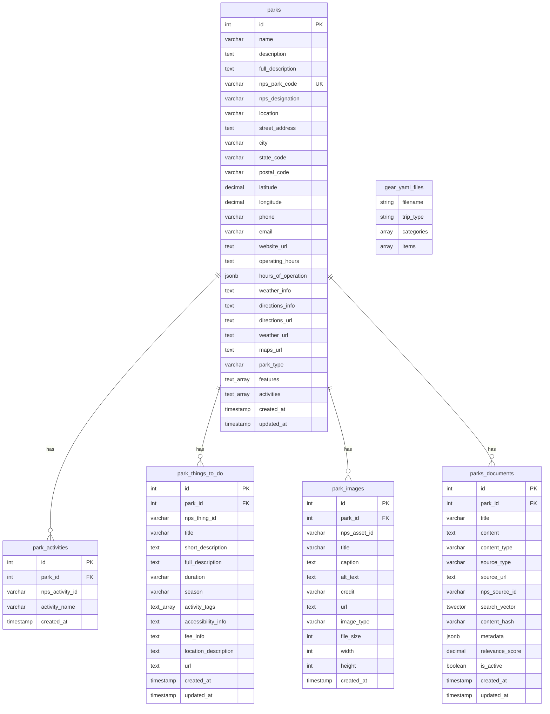

# TripBuddy Database Schema

## Entity Relationship Diagram

## Key Features

### **Core Entities**

- **parks**: Main park information with NPS API integration
- **parks_documents**: RAG content for LLM context

### **NPS API Integration**

- **park_activities**: Activities available at each park
- **park_things_to_do**: Detailed activity descriptions
- **park_images**: Multimedia content from NPS

### **External References**

- **Gear Templates**: Managed as YAML files (not in database)
  - `backpacking.yaml`
  - `car_camping.yaml`
  - `day_hiking.yaml`

### **Search Capabilities**

- **Full-text search** on parks and documents using PostgreSQL `tsvector`
- **Keyword search** for RAG content retrieval
- **Metadata** in JSONB for flexible queries

### **Simplified Architecture**

This schema focuses purely on:

1. **Park Data Storage** - Rich NPS API integration
2. **Content Management** - RAG-optimized document storage
3. **Search Performance** - Full-text search indexes

### **Application Layer Responsibilities**

- **Gear Recommendations**: Handled via YAML templates + stateless API
- **User Sessions**: Managed in application memory or external cache
- **Recommendation History**: Optional future enhancement
